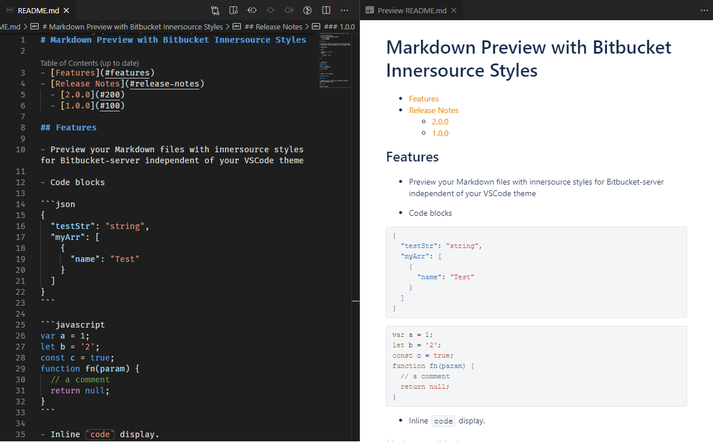

# Markdown Preview with Bitbucket Innersource Styles

- [Features](#features)
- [Release Notes](#release-notes)

## Features

- Preview your Markdown files with innersource styles for Bitbucket-server independent of your VSCode theme

## Release Notes

View [Changelog](CHANGELOG.md) for full details.
